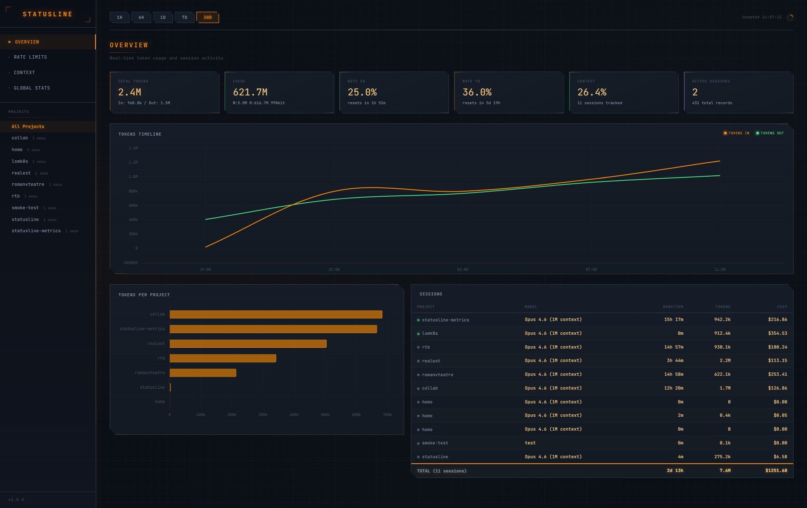
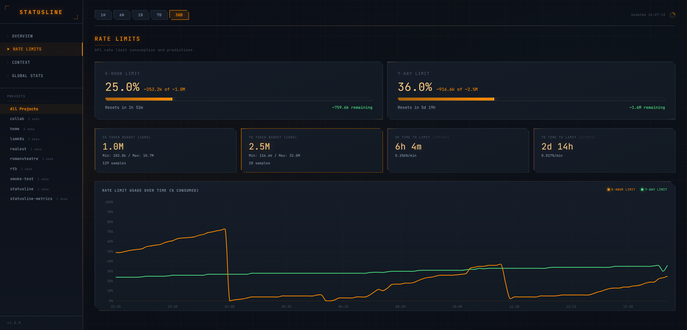
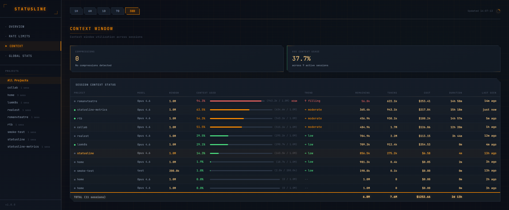
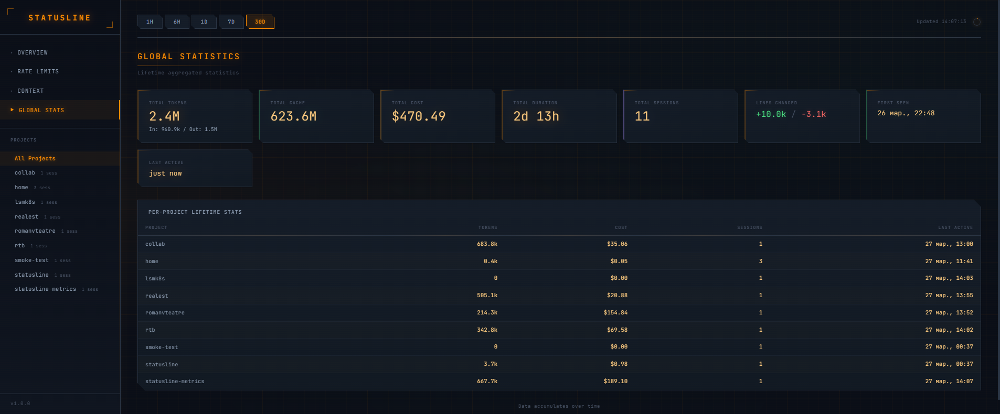

# Statusline Metrics

Collect and visualize Claude Code metrics. A lightweight client snippet in statusline.sh + SQLite backend + real-time dashboard.

```
statusline.sh (each Claude)  -->  metrics-server (SQLite)  -->  Dashboard (:9177)
      fire-and-forget                  single host                  browser
```

## What It Collects

Once per minute, for each project:

| Metric | Description |
|--------|-------------|
| Context window | Context usage % and window size |
| Rate limits | 5h and 7d limits (%, time until reset) |
| Tokens in/out | Input and output tokens (cumulative) |
| Cache write/read | Cache tokens (write, read) |
| Cost | Session cost in USD |
| Session time | Active session duration |
| API response time | API latency |
| Lines added/removed | Code lines changed |

Data is retained for **30 days**. Global statistics (total tokens ever) are kept indefinitely.

---

## Quick Start

### 1. Server

```bash
git clone https://github.com/user/statusline-metrics.git ~/statusline-metrics
cd ~/statusline-metrics
pip install -r server/requirements.txt
python server/metrics_server.py
```

The server listens on `http://localhost:9177`. Dashboard: `http://localhost:9177/`

### 2. Statusline Integration

Append this block to the **end** of your `~/.claude/statusline.sh` (after the last `printf`):

```bash
# -- Statusline Metrics: fire-and-forget collection --
[[ -z "$session_id" || "$session_id" == "unknown" ]] && { true; } || {
_m_state="/tmp/.claude_metrics_${session_id}"
_m_last=0; [[ -f "$_m_state" ]] && _m_last=$(< "$_m_state")
_m_now=$(date +%s)
if (( _m_now - _m_last >= 55 )); then
  IFS=$'\t' read -r _m_ppath _m_cost _m_apid _m_la _m_lr < <(
    printf '%s' "$input" | jq -r '[
      (.workspace.project_dir // ""),
      (.cost.total_cost_usd // 0),
      (.cost.total_api_duration_ms // 0),
      (.cost.total_lines_added // 0),
      (.cost.total_lines_removed // 0)
    ] | @tsv')
  [[ -z "$_m_ppath" ]] && _m_ppath="$cwd"
  _m_pname=$(basename "$_m_ppath")
  _m_ppath_safe="${_m_ppath//\\/\\\\}"
  _m_ppath_safe="${_m_ppath_safe//\"/\\\"}"
  _m_pname_safe="${_m_pname//\\/\\\\}"
  _m_pname_safe="${_m_pname_safe//\"/\\\"}"
  if command -v md5sum &>/dev/null; then
    _m_pid=$(printf '%s' "$_m_ppath" | md5sum | cut -c1-12)
  elif command -v md5 &>/dev/null; then
    _m_pid=$(printf '%s' "$_m_ppath" | md5 -q | cut -c1-12)
  else
    _m_pid=$(printf '%s' "$_m_ppath" | cksum | cut -d' ' -f1)
  fi
  _m_url="http://localhost:9177/api/metrics"
  _m_conf="$HOME/.claude/metrics/config"
  [[ -f "$_m_conf" ]] && source "$_m_conf"
  [[ -n "$METRICS_SERVER_URL" ]] && _m_url="$METRICS_SERVER_URL"
  _m_acct="${METRICS_ACCOUNT:-auto}"
  _m_json=$(printf '{"ts":%d,"sid":"%s","pid":"%s","pname":"%s","ppath":"%s","host":"%s","acct":"%s","model":"%s","ctx":%.2f,"ctxsz":%d,"r5h":%.1f,"r5hr":%d,"r7d":%.1f,"r7dr":%d,"tin":%d,"tout":%d,"cw":%d,"cr":%d,"cost":%s,"dur":%d,"apid":%s,"la":%s,"lr":%s}' \
    "$_m_now" "$session_id" "$_m_pid" "$_m_pname_safe" "$_m_ppath_safe" \
    "$(hostname)" "$_m_acct" "${model:-unknown}" \
    "${real_pct_f:-0}" "${ctx_win:-0}" \
    "${five_hr:-0}" "${five_resets:-0}" \
    "${seven_day:-0}" "${seven_resets:-0}" \
    "${total_in:-0}" "${total_out:-0}" \
    "${_cum_cc:-0}" "${_cum_cr:-0}" \
    "${_m_cost:-0}" \
    "${dur_ms:-0}" \
    "${_m_apid:-0}" \
    "${_m_la:-0}" \
    "${_m_lr:-0}")
  _m_fb="${HOME}/.claude/metrics/pending.jsonl"
  mkdir -p "$(dirname "$_m_fb")" 2>/dev/null
  _m_curl=(-s --max-time 1.5 -X POST "$_m_url" -H 'Content-Type: application/json')
  [[ -n "$METRICS_API_KEY" ]] && _m_curl+=(-H "Authorization: Bearer $METRICS_API_KEY")
  _m_curl+=(-d "$_m_json")
  {
    curl "${_m_curl[@]}" >/dev/null 2>&1 \
    && echo "$_m_now" > "$_m_state" \
    || { echo "$_m_json" >> "$_m_fb"; echo "$_m_now" > "$_m_state"; }
  } &
  disown 2>/dev/null
fi
}
```

The display portion of your statusline remains untouched. Metrics are sent in the background roughly every 60 seconds.

---

## Network Scenarios

### A. Single Host (everything local)

```
+----------------------------------+
|  Linux / macOS / Windows         |
|                                  |
|  statusline.sh                   |
|       | curl POST localhost:9177 |
|       v                          |
|  metrics-server (:9177)          |
|  SQLite + Dashboard              |
+----------------------------------+
```

No configuration needed. Works out of the box.

### B. Two Hosts on a LAN

A typical setup: the server runs on Linux, the client on Windows.

```
  +------------------------+        +------------------------+
  |  Windows (.200)        |        |  Linux (.100)          |
  |  Desktop               |        |  my-server, Ubuntu     |
  |                        |        |                        |
  |  statusline.sh         |        |  statusline.sh         |
  |       |                |        |       |                |
  |       | curl POST -----+------->|       | curl POST      |
  |       | 192.168.1.100  |  LAN   |       v localhost      |
  |       | :9177          |        |  metrics-server (:9177)|
  |       |                |        |  SQLite + Dashboard    |
  +------------------------+        +------------------------+

  Dashboard: http://192.168.1.100:9177  (accessible from both hosts)
```

**Server setup** (on .100):

```bash
# Start with binding on all interfaces (not just localhost)
# server/config.py or environment variable:
export METRICS_HOST=0.0.0.0
python server/metrics_server.py
```

**Client setup** (on .200, Windows):

Create the file `C:/Users/YOU/.claude/metrics/config`:

```bash
METRICS_SERVER_URL="http://192.168.1.100:9177/api/metrics"
```

Or in Git Bash: `~/.claude/metrics/config` (same thing).

That's it. The Windows statusline.sh will now send metrics to .100.

### C. Remote Server (over the internet / VPN)

```
  +---------------+       +---------------+       +---------------+
  |  Laptop       |       |  Desktop      |       |  VPS (server) |
  |  macOS        |       |  Windows      |       |  Linux         |
  |               |       |               |       |                |
  |  curl POST ---+------>|  curl POST ---+------>|  metrics-server|
  |  vpn/tunnel   |  VPN  |  vpn/tunnel   |  VPN  |  :9177         |
  +---------------+       +---------------+       +---------------+
```

**On each client** (`~/.claude/metrics/config`):

```bash
METRICS_SERVER_URL="http://your-vps-ip:9177/api/metrics"
METRICS_API_KEY="your-secret-key-here"
```

**On the server:** set the API key via config or environment variable:

```bash
export METRICS_API_KEY="your-secret-key-here"
export METRICS_HOST=0.0.0.0
python server/metrics_server.py
```

Without an API key, the server accepts POST requests from localhost only.
With an API key set, it accepts requests from any IP when the key matches.

---

## Client Configuration

File: `~/.claude/metrics/config`

| Variable | Default | Description |
|----------|---------|-------------|
| `METRICS_SERVER_URL` | `http://localhost:9177/api/metrics` | Server URL |
| `METRICS_API_KEY` | _(empty)_ | API key for remote server auth |
| `METRICS_ACCOUNT` | `auto` | Claude account name (for multi-account setups) |

Examples:

```bash
# Local server, single account (default -- you can skip creating this file)
METRICS_SERVER_URL="http://localhost:9177/api/metrics"

# Server on the LAN, account set explicitly
METRICS_SERVER_URL="http://192.168.1.100:9177/api/metrics"
METRICS_ACCOUNT="pro-main"

# Second account on the same machine (different config or env)
METRICS_SERVER_URL="http://192.168.1.100:9177/api/metrics"
METRICS_ACCOUNT="max-work"

# Server over VPN with authentication
METRICS_SERVER_URL="http://10.8.0.1:9177/api/metrics"
METRICS_API_KEY="abc123secret"
METRICS_ACCOUNT="personal"
```

### Multi-Account

If you run multiple Claude windows under different accounts on the same machine (e.g., Pro + Max, personal + work):

1. **Recommended:** set `METRICS_ACCOUNT` in your config -- a stable, human-readable name
2. **Auto mode:** if unset, the server groups sessions by `rate_limits.resets_at` -- sessions sharing the same reset time are treated as one account

Rate limits, prediction, and estimation are all per-account. Data from different accounts is never mixed.

## Server Configuration

Environment variables or `server/config.py`:

| Variable | Default | Description |
|----------|---------|-------------|
| `METRICS_HOST` | `127.0.0.1` | Bind address (`0.0.0.0` for LAN access) |
| `METRICS_PORT` | `9177` | Port |
| `METRICS_API_KEY` | _(empty)_ | If set, required for remote POST requests |
| `METRICS_RETENTION_DAYS` | `30` | Data retention period (days) |
| `METRICS_DB_PATH` | `~/.claude/metrics/statusline-metrics.db` | Database path |

---

## Fallback

If the server is unreachable, metrics are saved locally:

```
~/.claude/metrics/pending.jsonl
```

When the server comes back online, it automatically ingests data from pending.jsonl on startup.

## Autostart

**Linux (systemd user service):**

```bash
mkdir -p ~/.config/systemd/user
cat > ~/.config/systemd/user/statusline-metrics.service << 'EOF'
[Unit]
Description=Statusline Metrics Server
After=network.target

[Service]
Type=simple
ExecStart=/usr/bin/python3 %h/statusline-metrics/server/metrics_server.py
Restart=always
RestartSec=5
Environment=METRICS_HOST=0.0.0.0

[Install]
WantedBy=default.target
EOF

systemctl --user daemon-reload
systemctl --user enable --now statusline-metrics
```

**macOS (launchd):**

```bash
cat > ~/Library/LaunchAgents/com.statusline-metrics.plist << 'EOF'
<?xml version="1.0" encoding="UTF-8"?>
<!DOCTYPE plist PUBLIC "-//Apple//DTD PLIST 1.0//EN" "http://www.apple.com/DTDs/PropertyList-1.0.dtd">
<plist version="1.0">
<dict>
  <key>Label</key><string>com.statusline-metrics</string>
  <key>ProgramArguments</key>
  <array>
    <string>/usr/bin/python3</string>
    <string>/Users/YOU/statusline-metrics/server/metrics_server.py</string>
  </array>
  <key>RunAtLoad</key><true/>
  <key>KeepAlive</key><true/>
  <key>EnvironmentVariables</key>
  <dict>
    <key>METRICS_HOST</key><string>0.0.0.0</string>
  </dict>
</dict>
</plist>
EOF

launchctl load ~/Library/LaunchAgents/com.statusline-metrics.plist
```

**Windows (Task Scheduler):**

```bat
:: Create start_metrics.bat
echo start /B pythonw %USERPROFILE%\statusline-metrics\server\metrics_server.py > %USERPROFILE%\start_metrics.bat

:: Add to Task Scheduler: Trigger = At Logon, Action = start_metrics.bat
schtasks /create /tn "StatuslineMetrics" /tr "%USERPROFILE%\start_metrics.bat" /sc onlogon
```

---

## Project Structure

```
statusline-metrics/
├── README.md                  # This file
├── server/
│   ├── metrics_server.py      # Flask app (entry point)
│   ├── database.py            # SQLite init, queries, cleanup
│   ├── ingest.py              # Ingest pending.jsonl
│   ├── config.py              # Configuration
│   ├── requirements.txt       # flask, waitress
│   └── static/                # Dashboard
│       ├── index.html
│       ├── css/
│       │   └── dashboard.css
│       ├── js/
│       │   ├── app.js
│       │   ├── charts.js
│       │   └── api.js
│       └── vendor/            # Vendored JS libraries
│           └── chart.js      # Chart.js 4.4.7
└── install.sh                 # Setup script (vendor libs + dirs)
```

## Screenshots

| Overview | Rate Limits |
|----------|-------------|
|  |  |

| Context Window | Global Statistics |
|----------------|-------------------|
|  |  |

## Dashboard

Dashboard: `http://<server-ip>:9177/`

- Dark theme, minimalist UI
- Binance-style charts (time filters: 1h / 6h / 1d / 7d / 30d)
- Per-project breakdown
- Rate limit prediction
- Context window analysis (min/max/avg of actual token window size)
- Global all-time statistics

## Smoke Test

After installing the server and integrating the snippet into statusline.sh, verify everything works:

```bash
# 1. Is the server alive?
curl -s http://localhost:9177/api/health | python3 -m json.tool

# Expected response:
# {
#     "status": "ok",
#     "uptime_seconds": 42,
#     "db_size_bytes": 12288,
#     "total_records": 0,
#     "active_sessions": 0,
#     "pending_jsonl_exists": false,
#     "version": "1.0.0"
# }

# 2. Send a test metric manually:
curl -s -X POST http://localhost:9177/api/metrics \
  -H 'Content-Type: application/json' \
  -d '{
    "ts": 1711497600,
    "sid": "test-session-001",
    "pid": "a1b2c3d4e5f6",
    "pname": "my-project",
    "ppath": "/home/you/my-project",
    "host": "my-server",
    "acct": "pro-main",
    "model": "claude-opus-4-6",
    "ctx": 42.50,
    "ctxsz": 1000000,
    "r5h": 23.1,
    "r5hr": 1711505000,
    "r7d": 8.4,
    "r7dr": 1712100000,
    "tin": 150000,
    "tout": 45000,
    "cw": 80000,
    "cr": 35000,
    "cost": 0,
    "dur": 360000,
    "apid": 120000,
    "la": 245,
    "lr": 30
  }'

# Response: {"status": "ok"}

# 3. Verify the record was stored:
curl -s http://localhost:9177/api/projects | python3 -m json.tool

# Expected response:
# [
#     {
#         "project_id": "a1b2c3d4e5f6",
#         "project_name": "my-project",
#         "last_active": 1711497600,
#         "sessions_count": 1
#     }
# ]

# 4. Open the dashboard in your browser:
#    http://localhost:9177/
#    (or http://192.168.1.100:9177/ from another host on the LAN)
```

If steps 1-3 pass, the system is working. Launch Claude and within a minute real metrics will start appearing on the dashboard.

## Auto-Setup via Claude

If you want Claude Code to set up the system for you, copy this block into the chat:

```
Set up statusline-metrics on this machine:

1. Clone the repo to ~/statusline-metrics (if not already present)
2. Run install.sh (installs dependencies and vendor JS)
3. Start the server: python3 ~/statusline-metrics/server/metrics_server.py
4. Verify: curl -s http://localhost:9177/api/health
5. Append the metrics block to the end of my ~/.claude/statusline.sh
   (the block from README.md, section "Statusline Integration")
   IMPORTANT: do not modify the existing statusline.sh code, only append the block at the END
6. Verify the statusline display is unchanged
7. Set up server autostart (systemd on Linux, launchd on macOS)

The server should listen on 0.0.0.0:9177 (for LAN access).
Client config: ~/.claude/metrics/config
```

To set up a **remote client** (e.g., a Windows machine sending metrics to a Linux server):

```
On my Windows machine, set up the statusline-metrics client:

1. Create the file ~/.claude/metrics/config with contents:
   METRICS_SERVER_URL="http://192.168.1.100:9177/api/metrics"
   METRICS_ACCOUNT="desktop"

2. Append the metrics block to the end of my ~/.claude/statusline.sh
   (from the statusline-metrics repo README)
   IMPORTANT: the block goes AFTER the last printf, changing nothing else

3. Verify: curl -s http://192.168.1.100:9177/api/health
```

## API Reference

```
POST /api/metrics                    -- ingest metrics from a client
GET  /api/health                     -- server status
GET  /api/projects                   -- list of projects
GET  /api/projects/:id/summary       -- per-project summary
GET  /api/projects/summary-all       -- aggregated summary across all projects
GET  /api/metrics                    -- time-series (project_id, from, to, interval)
GET  /api/rate-limits/current        -- current 5h/7d limits
GET  /api/rate-limits/history        -- rate limit history
GET  /api/rate-limits/prediction     -- exhaustion forecast
GET  /api/rate-limits/estimates      -- token budget estimate
GET  /api/context-window/analysis    -- context window analysis
GET  /api/global-stats               -- all-time statistics
GET  /api/sessions                   -- list of sessions
GET  /api/response-time              -- API response time
```

All GET endpoints support `?account=X` for multi-account filtering.

## Troubleshooting

**Server won't start:**
- Port 9177 already in use? `ss -tlnp | grep 9177`
- Python < 3.9? `python3 --version`
- Missing dependencies? `pip install -r server/requirements.txt`

**Metrics not arriving:**
- Is the server reachable? `curl http://localhost:9177/api/health`
- Is statusline.sh updated? Check for the metrics block at the end of the file
- Is fallback working? `ls ~/.claude/metrics/pending.jsonl`

**Dashboard is empty:**
- Correct time range selected? Try 30d
- Is a project selected? Click "All Projects"
- Any records? Check `curl -s http://localhost:9177/api/health | python3 -m json.tool` -- look at the `total_records` field

**Rate limit exceeded (429):**
- The server enforces 120 records/minute per session
- Normal cadence is one submission every 60 seconds, well within the limit
- If you're hitting this, make sure statusline.sh isn't running in a tight loop

## Requirements

- Python 3.9+
- bash 4+ (Linux/macOS) or Git Bash 5+ (Windows)
- curl, jq (already required by statusline.sh)
